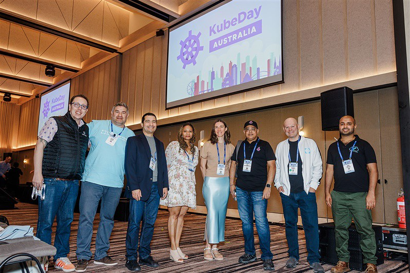

# KubeDay - APAC 2024

I was honored to deliver a keynote at KubeDay 2024 in Melbourne, Australia. Interestingly, all keynotes at this event converged around one theme: meeting the high demand for fast, reliable, and compliant service onboarding into platforms—typically supported by custom Kubernetes control planes powered by operators.

My talk explored why in-house operators differ fundamentally from typical application software and the unique challenges they present for reliability testing. I addressed several key difficulties in load testing operators: the cost of provisioning real resources, complex dependencies between resources, and the lack of industry-standard load testing tools for operator workloads.

I also challenged the audience to consider whether building custom operators is always the right approach, presenting alternative strategies that might better serve their platform needs in certain scenarios.

[https://kubedayaustralia2024.sched.com/](https://kubedayaustralia2024.sched.com/)

[Kubeday Landing Page](https://events.linuxfoundation.org/kubeday-australia/) (not permanent link to 2024 event)

## Slides

- [Download PDF](./Operators-Load-Testing.pdf)
- [Download PowerPoint](./Operators-Load-Testing.pptx)

## Photos

