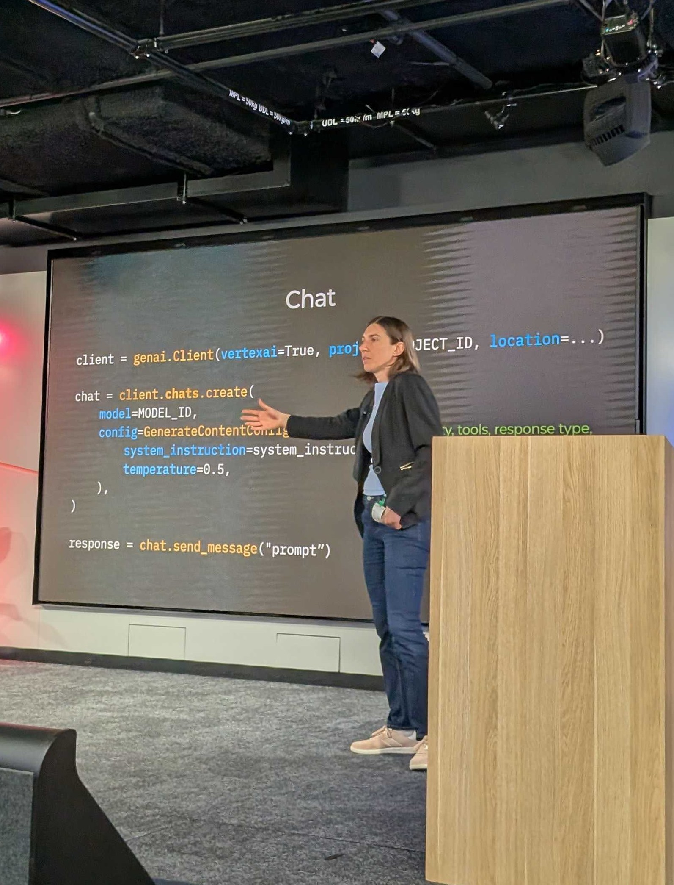
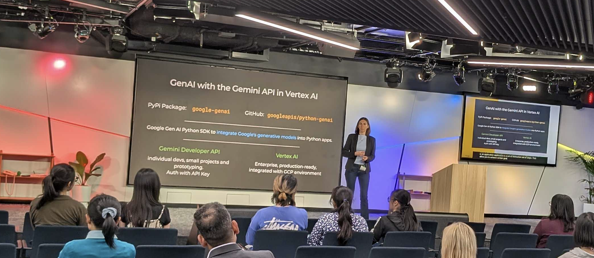

# ANZ GEN AI Academy Workshop - GDG Cloud Sydney

On November 11th, I led a workshop titled "Explore Generative AI with the Gemini API in Vertex AI" as part of the ANZ GEN AI Academy. This hands-on workshop introduced participants to Google's generative AI capabilities, covering key concepts from the Google Cloud Skills Boost lab and demonstrating practical implementations using the Gemini API in Vertex AI.

The workshop covered essential topics including the Python SDK for GenAI (google-genai package), chat functionality with configuration options, batch predictions for efficient processing, function calling for enhanced LLM capabilities, token counting, and caching strategies for cost optimization.

[Workshop Event Details](https://gdg.community.dev/events/details/google-gdg-cloud-sydney-presents-anz-gen-ai-academy-workshop/)

## About ANZ GEN AI Academy

[ANZ GEN AI Academy](https://gdg.community.dev/events/details/google-gdg-cloud-sydney-presents-anz-gen-ai-academy/cohost-gdg-ai-for-science-australia) is designed for professionals and innovators across Australia and New Zealand. Delivered online and powered by Google Cloud Skills Boost platform, this program offers hands-on training with the latest in Generative AI, Gemini and Vertex AI.

## Lab

The workshop is based on the Google Cloud Skills Boost lab: [Explore Generative AI with the Gemini API in Vertex AI](https://www.skills.google/course_templates/959)

## Slides

- [Download PDF](./GenAI-with-Gemini-API-in-Vertex-AI.pdf)

## Photos

